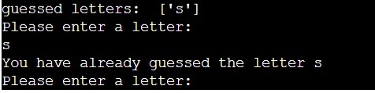
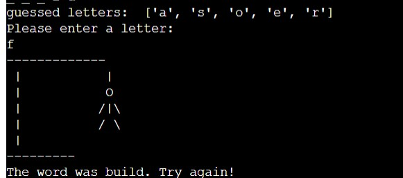
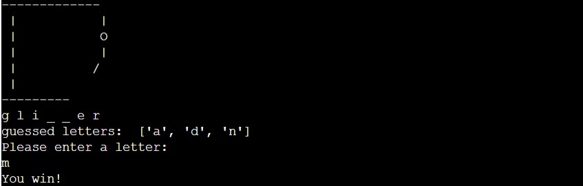
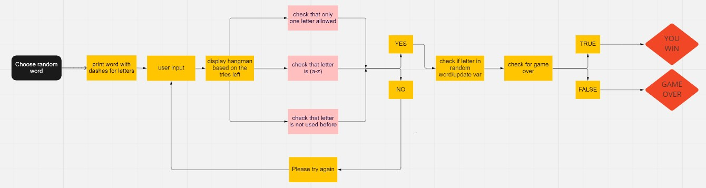
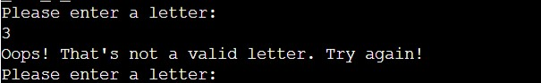
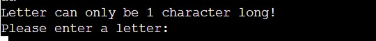
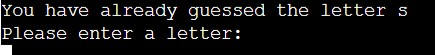
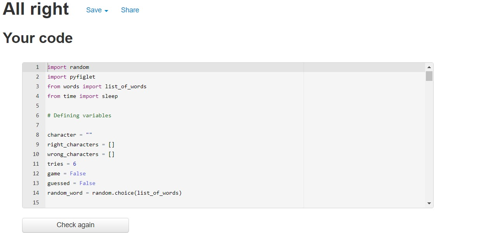

# The Hangman
- This project was made as a part of a Full Stack Developer Programme by Code Institute. All information contained on the page is intended for course use only.
[View the live project here.](https://the-hangman-x.herokuapp.com/)
-----
## Who is this website for and what does it do? 

Hangman is an interactive game made using Python. User goal is to guess the word that's randomly chosen from a pre-made list of English words. Each letter in a word is represented with an underscore which is displayed to the User. The user can make a guess six times. For each incorrect guess, a body part is being added to the "hangman". The goal is to guess the word within six tries and not complete the hangman. The game is made for everyone above 12 years of age. 

-----

## Main Features
- __The title__

    - Immediatly after the app is loaded, the User is greeted with a "hangman" logo.
    - The logo was made using [Pyfiglet](https://pypi.org/project/pyfiglet/0.7/)

- __Name Input__

  - The user gets asked to input his/hers name

  - After the name has been submitted, User gets a personal greeting and basic rules of the game.
  

- __The Gameplay__

 - User gets presented with a display of a "hanger" and underscores. Each uncerscore represents a letter from a word. User is then asked to make a guess of the word.
 - User can only input letters from (a-z), every other character will not be accepted as a valid input.
 - All characters are automatically tranformed to lowercase letters as Python compares strings based on their ASCII or Unicode  code points. This is to avoid confusion and make the game run without significant issues.
- If a User guesses the letter, the underscore is automatically replaced by the letter.

 

 - When a User makes an incorrect guess the guessed letter is being shown on the screen together with a body part of a hangman being drawn on. The guessed letter on screen makes it easier to follow the attempts the User has made. The user cannot make the same guess twice.

 
 

- If User doesn't make a valid guess, the "You lose" message is displayed and the whole hangman is drawn.

 

- If the User makes a valid guess, the "You win" message displays at the end.
 

 ## Flowchart

  - The flowchart for the game.

## User Input Testings

This app has been tested manually.
- If a User enters a number instead of a letter he gets a message saying it's not a valid input. The user must enter a character again. The attempt is not recorded as a try.

- If a User enters more than one character he gets a warning that a letter can only contain one character.

- User cannot enter the same character twice.

## Validator Testing

* This code passes the PEP8 online Python Validator. 

    

## Technologies Used

### Frameworks, Libraries & Programs Used

1. [Python](https://www.python.org/)
    - Python was the program used for the whole project.
1. [Git](https://git-scm.com/)
    - Git was used for version control by utilizing the Gitpod terminal to commit to Git and Push to GitHub.
1. [GitHub:](https://github.com/)
    - GitHub is used to store the projects code after being pushed from Git.
1. [Flowchart](https://miro.com/app/dashboard/)
    - Miro was used to create the flowchart during the design process.
1. [Heroku](https://dashboard.heroku.com/apps)
    - Heroku was used to deploy the app alongside github.

## Libraries Used

* Python libraries used for this project.

    * [pyfiglet](https://pypi.org/project/pyfiglet/0.7/)

### Unresolved Bugs

-Currently no unresolved bugs found

## Deployment

### GitHub Pages

To deploy the site to Github pages the following steps should be followed: 

1. Log in to GitHub and locate the [GitHub Repository](https://github.com/)
2. At the top of the Repository (not top of page), locate the "Settings" Button on the menu.
3. Scroll down the Settings page until you locate the "GitHub Pages" that now has it's own dedicated tab.
4. Under "Source", click the dropdown called "None" and select "Master Branch".
5. The page will automatically refresh.
6. The link to your page will now show up with "Your site is published at:" 

### Forking the GitHub Repository

Forking the GitHub Repository means we make a copy of the original repository on our GitHub account to view and make changes without affecting the original repository by using the following steps...

1. Log in to GitHub and locate the [GitHub Repository](https://github.com/) you want to fork.
2. At the top of the Repository (not top of page) just above the "Settings" Button on the menu, you will see a fork button.
3. Click on the button to create a copy. 
4. You should now have a copy of the original repository in your GitHub account.

### Making a Local Clone

1. Log in to GitHub and locate the [GitHub Repository](https://github.com/) you want to deploy.
2. Under the repository name, click "Clone or download".
3. To clone the repository using HTTPS, under "Clone with HTTPS", copy the link.
4. Open Git Bash in your IDE.
5. Change the current working directory to the location where you want the cloned directory to be made.
6. Type `git clone`, and then paste the URL you copied.
7. Press enter and the clone should be created.

## Creating an Application with Heroku

- Log in to [Heroku](https://dashboard.heroku.com/)
- Make a new app, name it and choose the region
- Set the Reveal Config Vars
- Set PORT 8000
- Add build pack Python and Node.js, Python first
- Go to the Deployment settings at the top
- Deploy using github
- Automatic deploys for new builds when changes are pushed to GitHub
- Manual deploys for a new build every time the button is clicked
- Once completed - View App button 

## Credits

### Code

-   The hangman display came from [here](https://inventwithpython.com/invent4thed/chapter8.html)

### Acknowledgements

-   Slack student support.

-   [Kite](https://www.youtube.com/c/KiteHQ) 

