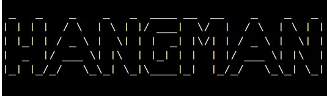
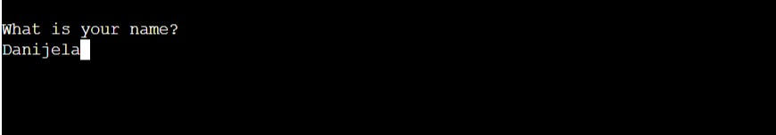
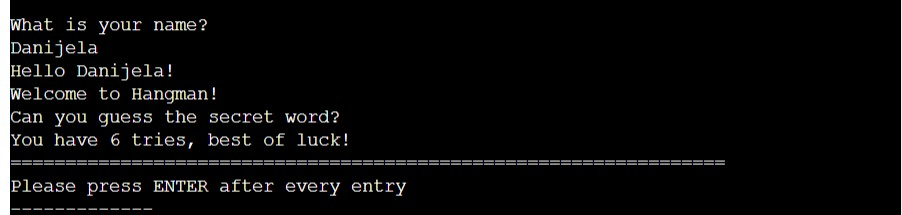
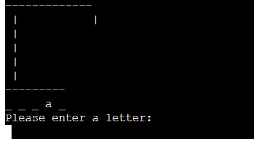
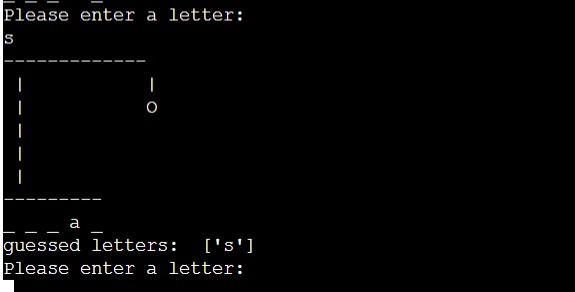

# The Hangman
- This project was made as a part of a Full Stack Developer Programme by Code Institute. All information contained on the page is intended for course use only.
[View the live project here.](https://the-hangman-x.herokuapp.com/)
-----
## Who is this website for and what does it do? 

Hangman is an interactive game made using Python. User goal is to guess the word that's randomly chosen from a pre-made list of English words. Each letter in a word is represented with an underscore which is displayed to the User. The user can make a guess six times. For each incorrect guess, a body part is being added to the "hangman". The goal is to guess the word within six tries and not complete the hangman. The game is made for everyone above 12 years of age. 

-----

## Main Features
- __The title__

    - Immediatly after the app is loaded, the User is greeted with a "hangman" logo.
    - The logo was made using [Pyfiglet](https://pypi.org/project/pyfiglet/0.7/)

- __Name Input__

  - The user gets asked to input his/hers name

  - After the name has been submitted, User gets a personal greeting and basic rules of the game.
  

- __The Gameplay__

 - User gets presented with a display of a "hanger" and underscores. Each uncerscore represents a letter from a word. User is then asked to make a guess of the word.
 - User can only input letters from (a-z), every other character will not be accepted as a valid input.
 - All characters are automatically tranformed to lowercase letters as Python compares strings based on their ASCII or Unicode  code points. This is to avoid confusion and make the game run without significant issues.
- If a User guesses the letter, the underscore is automatically replaced by the letter.

 

 - When a User makes an incorrect guess the guessed letter is being shown on the screen together with a body part of a hangman being drawn on. The guessed letter on screen makes it easier to follow the attempts you made. The user cannot make the same guess twice.

 

